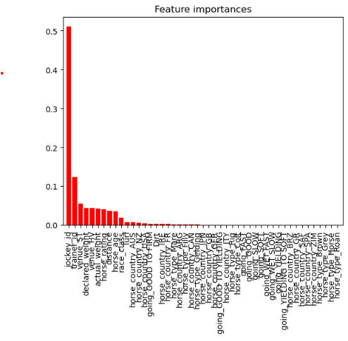

# PREDICTING HORSE RACE RESULTS IN HONG KONG (1997-2005)

## NON-TECHNICAL EXPLANATION OF YOUR PROJECT
As the final project in my Imperial Business School qualification in Machine Learning and Artificial Intelligence, I will attempt to predict the place a horse will finish in a race, using horse racing data from Hong Kong between 1997-2005. I set up a supervised regression problem, pre-processing the input data by removing missing values and converting categorical inputs into boolean values. Prior to finalising our model, we decide between ensemble methods, tuning their hyperparameters and selecting between them using performance metrics such as MSE, MAE, RMSE, and R-Squared. The results of the final model are analysed using these calculated metrics and feature importance rankings.   

## DATA
I am using data from Kaggle
https://www.kaggle.com/datasets/gdaley/hkracing?select=runs.csv
which contains individual horse metrics and race conditions for horse races in Hong Kong between 1997 and 2005. 

Please refer to the model card for more in-depth information.

## MODEL 
For my model, I chose between two ensemble methods:
- Gradient Boosting
- Random Forests

I chose ensemble methods for multiple reasons:
- *Ensemble Methods* - The aggregation of models in ensemble methods help to reduce overfitting, which improves generalization.
- *Non-Linearity* - This dataset has many features, which may or may not have a linear relationship with the outcome. Ensemble methods capture non-linear relationships well.
- *Tuning* - There are many hyperparameters to tune, and provide methods for ranking, and interpreting feature importance. This means I will not only be able to predict if a horse's finishing position in a race, but also what factors are most important in predicting the win.

After tuning the hyperparameters of both modes, I found that the MSE, RMSE, and MAE were lower for the Gradient Boosting Regressor, and that the r-squared values was higher. Because of this, I selected the GBR model.

## HYPERPARAMETER OPTIMSATION
Description of which hyperparameters you have and how you chose to optimise them. 

For the Gradient Boosting regressor, I chose the optimize the following hyperparameters:
- n_estimators: The number of trees in the forest
- learning_rate: The step-size shrinkage
- max_depth: Controls the tree depth
- min_samples_split: The minimum number of samples required to split an internal node

And optimized them using BayesSearchCV, chosen due to it's efficiency and adaptability to real-world data sets.

## RESULTS
My final model had the model performance metrics:

|           Model       |      mse      |     rmse     |     mae      |     r2       |
|----------------------|---------------|--------------|--------------|--------------|
|           GBR        |   13.245066   |   3.639377   |   3.064864   |   0.047022   |

This shows a relative accuracy in determining a horses finishing position up to 4 places, due to the MAE of just over 3. However, as there were only 14 horses in each race, this is not a high level of accuracy. Also note the low r2 values, suggesting poor fit. Overall I would say this model is a poor predictor of a horse's finishing position in a race.

However, the feature importance does show some interesting data. Notably, that the jockey is more important in determining the result of a race by an extreme margin. This is followed by the trainer. This suggests the horse's individual stats are significantly less important than the jockey riding it and it's trainer in what place it finishes in.

It is important to note that due to the limitations of the dataset, this is likely not applicable to other countries and race courses.

